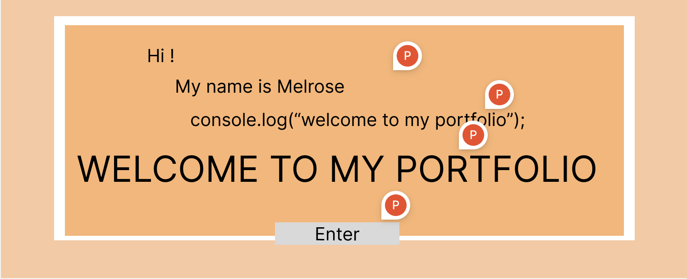
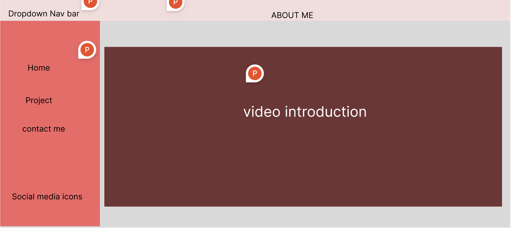
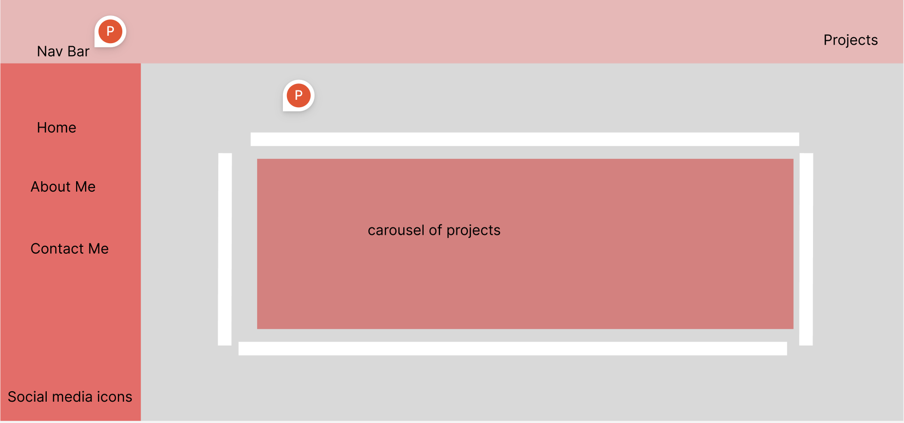
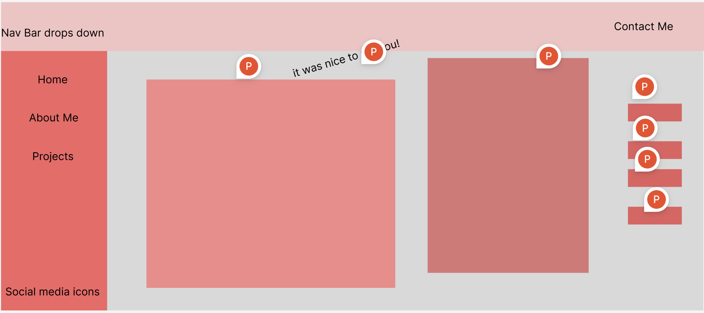

# Hi There! Thank you for visiting my portfolio!

I am very excited to share with you my creation!

## GitHub Link
[I am a link placeholder](#)

## Technoliges Used List
* Visual Studio Code
* Github
* Javascript
* HTML
* CSS

## Installation Instructions
To install Visual Studio Code
1. Download and Install VS code. 
[Click Here for VS Code link](https://code.visualstudio.com/Download)

## Wireframes
As you may see, I used my wireframes as a skeleton on how I want my portfolio to look like and made improvisations

#### HOME PAGE

#### ABOUT ME PAGE
 

#### PROJECTS PAGE

#### CONTACT ME PAGE

## User Story
As a user, I want to be able to navigate around the webpage smoothly. I want to see how the webpage interacts with me and how it showcases the skills of the software engineer. 

## My Hurdles
The biggest hurdle in my project so far would be making sure that my javascript functions are working 100%.